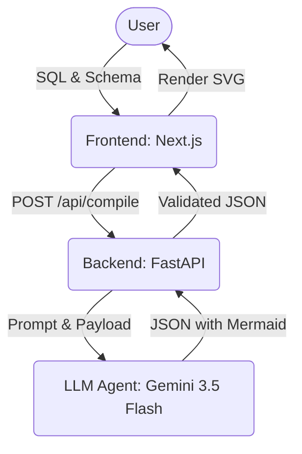

# Project Architecture: Query Optic

## 1. System Overview
Query Optic is an intelligent visual SQL analyzer. It takes raw SQL queries and optional database schemas and leverages an AI agent to transform them into interactive logical data flow diagrams. 

The system follows a classic **Client-Server Architecture**, decoupled into a frontend Single Page Application (React/Next.js) and a backend API server (FastAPI) responsible for AI orchestration and response parsing.

## 2. Architecture Diagram



## 3. Folder Structure

```text
c:\QueryOptimizer\
├── backend/
│   ├── main.py           # Core FastAPI application and Gemini agent interaction
│   └── .env              # Environment configurations (Gemini keys)
├── frontend/
│   ├── src/app/
│   │   ├── page.tsx      # Main application page (Design Studio UI & network calls)
│   │   ├── layout.tsx    # Next.js layout configuration
│   │   └── components/   # Reusable UI components
│   │       ├── VisualCanvas.tsx   # Mermaid.js rendering engine and click capturing
│   │       └── simulators/        # (Future use) Mock data simulation UI
│   ├── tailwind.config.ts# Styling definitions
│   └── package.json      # Frontend dependencies
├── guidelines.md         # Comprehensive AI Agent development protocols
├── project_description.md# High-level project context
└── principal_sql_data_architect_skill.md # Specific Agent documentation
```

## 4. Technology Stack
- **Frontend:** Next.js (App Router), React, Tailwind CSS, Mermaid.js
- **Backend:** Python, FastAPI, Pydantic, `google-genai` SDK
- **AI/ML:** Google Gemini (`gemini-3.5-flash`)
- **Deployment/Environment:** Node.js (Frontend), Python Virtual Environment (Backend)

## 5. Component Breakdown

### Frontend: Design Studio (`src/app/page.tsx`)
- **Purpose:** Provide the main user interface for inputting code and viewing results.
- **Inputs:** User-edited texts (SQL & Schema), response payloads from the backend.
- **Outputs:** Triggers API calls, conditionally renders loading arrays, passes graph states to `VisualCanvas`.

### Frontend: Visual Canvas (`src/app/components/VisualCanvas.tsx`)
- **Purpose:** Safely renders the Mermaid flowchart string based on backend payload. In addition, captures node clicks natively.
- **Dependencies:** `mermaid`.
- **Inputs:** `graphDefinition` (Mermaid format string), `onNodeSelected` (function).

### Backend: API Layer (`backend/main.py`)
- **Purpose:** Main intermediary between the frontend and the Gemini LLM.
- **Dependencies:** `fastapi`, `pydantic`.
- **Inputs:** Requests to `/api/compile`.

### Backend: SQL Data Architect Agent
- **Purpose:** Perform semantic logical mapping of the requested SQL code accurately reproducing engine execution plans into a visual string format.

## 6. Data Flow
1. **User Input:** User edits a SQL statement and schema.
2. **Data Transmission:** Pressing "Analyze Options" dispatches the state to `POST /api/compile` on the backend.
3. **Agent Orchestration:** The backend bundles the payload beneath a highly restrictive `SYSTEM_PROMPT` tailored for accurate topological mapping.
4. **LLM Processing:** Gemini 3.5 Flash evaluates the logic and maps out node structures sequentially.
5. **Response Extraction:** FastAPI parses the raw text string to isolate the JSON dictionary blocks, circumventing standard markdown wrappers mapping issues.
6. **Visualization:** The extracted `mermaid_graph` string is piped back to Next.js and executed precisely inside `mermaid.render()` in `VisualCanvas.tsx`.

## 7. Database Design
- **Database:** N/A (Stateless Application)
- Query Optic avoids local or remote databases entirely. Instead, all logic, query caching, and node definitions execute entirely at runtime through the LLM context window. User data resides strictly in the localized browser session.

## 8. API Documentation
### `POST /api/compile`
- **Purpose:** Compiles SQL queries into valid visual component schemas.
- **Request Format:** 
  ```json
  {
    "sql": "SELECT category FROM orders",
    "schema": "CREATE TABLE orders (category varchar);"
  }
  ```
- **Response Format (Success):**
  ```json
  {
    "mermaid_graph": "flowchart TD\\n ...",
    "nodes_metadata": { 
        "NODE_ID": { 
           "title": "Operation", 
           "impact": "High",
           "explanation": "Explains why",
           "fix": null 
        } 
    }
  }
  ```
- **Authentication Requirements:** Internal `.env` `GEMINI_API_KEY` presence; No user-facing JWTs or OAuth tokens required.

## 9. Agent Architecture 
- **Agent Name:** Principal SQL Data Architect (`gemini-3.5-flash`)
- **Role:** Deep analytical parser evaluating query step efficiency.
- **Trigger Conditions:** Synchronously on every frontend compile invocation.
- **Decision-making process:** Forces adherence to predefined logic pipelines, mapping basic Base Table selection prior to `JOIN`, `GROUP BY`, `HAVING`, and finally `ORDER BY`. Formats the output JSON specifically matching prompt instructions to ensure proper Mermaid parsing avoiding special character corruption.

## 10. Security Architecture
- **Environment Context Isolation:** `GEMINI_API_KEY` is fully contained in the backend `.env` boundary. Next.js has zero visibility of the keys, preventing exposing valid payment keys across browser environments.
- **CORS Initialization:** Explicitly permits global execution origins (`["*"]`) facilitating highly local development scenarios and hot-reloads.
- **Validation:** Utilizes Pydantic input Models ensuring the endpoint evaluates validated input structures, nullifying basic prompt-injection wrappers on the input frame.

## 11. Scalability & Performance
- **Horizontal Scaling:** The backend endpoints are stateless. Deployments can horizontally balance request load effectively without sticky sessions requirements.
- **Bottlenecks:** Architecture speed scales inversely with Google API Token quota limitations. 
- **Opportunities:** Implementing robust edge caching strategies (like Redis instance memory) to block redundant compile calls on commonly viewed queries.

## 12. Deployment Architecture
- **Development Environment:** Isolated terminals running `npm run dev` on port `3000` (Node.js) and `uvicorn main:app --reload` on port `8000` (Python/Uvicorn).
- **Production Architecture (Projected):** Next.js decoupled to Vercel/Netlify for CDN static serving and edge-routing; FastAPI shipped as a standard Docker container managed easily through AWS Fargate or Render.

## 13. Error Handling & Logging
- **Missing API Keys Validation:** Triggers a swift `HTTP 400 (Bad Request)` inside `main.py` guarding external calls from executing without viable credential configurations.
- **JSON Fallback Parsing:** If the AI hallucinates outside deterministic ranges preventing correct mapping (JSON extraction errors), Python throws a local value exception piped directly as an `HTTP 500 (Internal Server Error)`.
- **Frontend Degradation:** `page.tsx` gracefully catches endpoint status errors rendering localized visible red warning banners directly atop the main visual stage rather than terminating the page window.

## 14. Design Decisions & Trade-offs
- **Decoupled Core Architectures (FastAPI vs Next.js SSR API Routes):** While Next.js App routes theoretically could handle the API connection alone, Python FastAPI is implemented allowing the utilization of specialized AI dependencies like `google-genai` and giving developers future expansion room directly into dense machine learning workflows.
- **Heavy System Prompting Approach:** We opted to rely on an extensive structural `SYSTEM_PROMPT` configuration combined with low model temperature (`0.1`) instead of utilizing explicit Structural Output dependencies (`Instructor`) or Fine-Tuning. This saves implementation complexity but holds slight stability tradeoffs towards hallucinated format outputs.

## 15. Future Improvements
- **Token Optimization Tracking:** Implementing structured logging to observe total Gemini token consumption usage natively in the FastAPI output logs.
- **Structured LLM Tools Layer:** Implementing Pydantic validation on the outbound string response prior to returning the frontend JSON, preventing Mermaid from crashing on minor formatting violations.
- **Caching Orchestrations:** Build Redis or standard LRU-cache strategies mapping explicit SQL bodies resolving directly without burning repeated Gemini API bandwidth targets.
