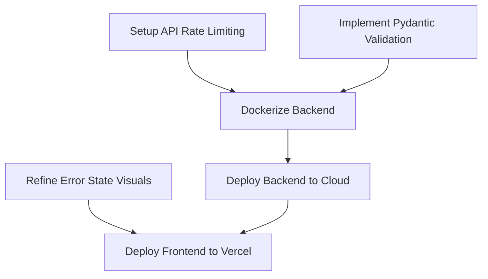

# Implementation Plan: Query Optic

## 1. Project Summary
- **Project Objective:** Provide developers and administrators heavily-reliable insight into query structure plans natively turning standard SQL string data into high-fidelity AI-derived Mermaid diagrams.
- **Target Users:** Backend software engineers, database administrators, data analysts, and educational environments aiming to visualize optimization gaps.
- **Core Problem:** The inability to easily map complex query optimization steps, filter layers, and index strategies graphically without executing against heavy local database engines.
- **Current Status:** Foundation established visually and syntactically. The basic UI and the Gemini 3.5 execution logic work end-to-end to generate charts.
- **Completion Percentage:** ~60% (Core engine functional, lacks structural validation layers, test coverage, monitoring, and query histories).

---

## 2. Current State Assessment

### Backend API (FastAPI)
- ✅ **Completed:** `api/compile` endpoint, Gemini system prompt engineering, basic Pydantic constraints.
- 🚧 **In Progress:** Reliable JSON parsing (currently utilizes basic `{` boundary slicing).
- ⏳ **Not Started:** Response validation, API telemetry, payload hashing/caching.
- ⚠ **Needs Refactoring:** Hardcoded string processing in `main.py` -> `content.find('{')`.

### Frontend Engine (Next.js)
- ✅ **Completed:** Main design studio (`page.tsx`), Tailwind integration, dynamic Mermaid SVG painting (`VisualCanvas.tsx`), cross-node clicks interception.
- 🚧 **In Progress:** `DataSimulator` components structure (folder exists, visually missing from main view).
- ❌ **Missing:** Error boundary graceful fallbacks, UI loading skeletons, query saved history states, session local storage.

---

## 3. Development Roadmap

### Phase 1 – Solidification & Stability (Current Focus)
- **Objective:** Move the engine from an MVP state into a bulletproof execution flow handling malformed LLM responses natively.
- **Deliverables:** Pydantic LLM Output formatters, Strict Typescript Interfaces alignment.
- **Dependencies:** OpenAI/Gemini Structured Outputs library (`Instructor` or equivalent).
- **Estimated effort:** 1 Week.

### Phase 2 – Mock Simulator Features
- **Objective:** Re-integrate the `DataSimulator` to give users simulated latency outputs alongside visual grids.
- **Deliverables:** Interactive component expanding `DataSimulator.tsx`, mocked tabular return arrays based on user schema.
- **Dependencies:** None.
- **Estimated effort:** 1.5 Weeks.

### Phase 3 – Production Readiness (Deployment)
- **Objective:** Deploy to public clouds securing endpoints against abusive quota burning.
- **Deliverables:** API Rate limiting middlewares, Vercel frontend build deployment, Dockerized backend deployment pushing to AWS/Render, structured JSON logging.
- **Dependencies:** Redis Cache server, Vercel SDK, Docker.
- **Estimated effort:** 1 Week.

---

## 4. Feature-by-Feature Implementation Checklist

### Feature: Structured AI Parsing
- **Purpose:** Prevent `json.loads()` crash when the AI hallucinates missing commas or incorrect quotations.
- **Required Files:** `backend/main.py`
- **Implementation Steps:** Implement `pydantic` output schema bounds directly mapping to the Gemini execution, replacing the manual slicing block. 
- **Validation Rules:** Must throw distinct Pydantic validation errors rather than generic TypeErrors.

### Feature: Local History Caching
- **Purpose:** Allow users to switch between previously run queries without re-firing API quotas.
- **Required Files:** `frontend/src/app/page.tsx`, `frontend/src/app/components/HistorySidebar.tsx`
- **Implementation Steps:** Wrap `useEffect` pushing successful payloads to `localStorage` or `sessionStorage`. Map history chips alongside the `Target SQL Block`.

---

## 5. API Implementation Plan

### `POST /api/compile`
- **Purpose:** Central processing bridge for the Design Studio.
- **Authentication:** Currently skipped. For production scalability, a JWT token or strict rate-limiting per-IP logic must be injected.
- **Validation:** Expand the Pydantic `DesignPayload` to limit max string length on `sql` input (e.g., 20,000 characters) to prevent token saturation.
- **Possible Errors:** `HTTP 400` (Bad Schema Layout payload missing required variables); `HTTP 500` (GenAI network failure / JSON mapping breaks).

---

## 6. Database Implementation Plan
- **Current Philosophy:** Entirely stateless AI execution.
- **Future Improvements:** Connect a lightweight Redis container instance exclusively to cache hashed inputs protecting redundant queries from hitting GenAI billing layers.
  - **Tables/Collections:** Single Key/Value dict mapping `sha256(sql_string + schema_string) -> mermaid_json_payload`.
  - **Migration Steps:** Simple container-level boot.

---

## 7. Frontend Implementation Plan

### Page: Design Studio (Root `/`)
- **Components:** `Terminal Inputs`, `VisualCanvas`, `DataSimulator` (pending).
- **State Management:** Native React `useState`; consider migration to `Zustand` if node-click selection state gets deeply nested interacting with Simulators.
- **Error Handling:** Currently a generic static top-banner `errorMsg`. Must migrate to a Toast notification framework (e.g., `react-hot-toast`) ensuring error stacking.
- **Loading States:** Move from opacity arrays (`disabled:opacity-50`) to explicit spinner SVGs inside the Action button.

---

## 8. Backend Implementation Plan

### Module: `main.py`
- **Controllers:** `/api/compile`
- **Middleware:** `CORSMiddleware` (Needs strict array bound `["https://yoursite.com"]` prior to prod deploy, replacing `*`).
- **Error Handling:** Gracefully wrap network API timeouts in explicitly mapped `HTTP 502/Gateway Timeout` instead of arbitrary `HTTP 500` outputs.

---

## 9. AI / Agent Implementation Plan

### Agent: Principal SQL Data Architect
- **Trigger Conditions:** Receives API query.
- **Inputs:** `SQL` and `Schema`.
- **Decision Flow:** 
  - Token evaluates schema against tables mapping operations chronologically down memory layer.
  - Converts operations implicitly wrapping color tags on the final JSON array.
- **Error Recovery:** (Pending) Needs an automatic retry-loop triggering exactly once if the first parsing stage throws a JSON load error. 

---

## 10. Security Implementation Plan

- **Rate Limiting:** Mandatory prior to cloud release mapping incoming IPs resolving at 10 requests per minute max to firewall quota depletion vectors.
- **Secrets Management:** Double-check `.gitignore` verifying `.env` logic never branches downstream. Do not surface Gemini keys to NextJS payloads.
- **CORS Mitigation:** Restrict `allow_origins`.

---

## 11. Testing Strategy

- **Unit Tests:** Run Python `pytest` against `test_gemini.py` validating that fake/mock valid JSON layouts parse flawlessly over the `/api/compile` dependency injects.
- **E2E Tests:** Implement `Playwright` to test Next.js input terminals mapping test queries, clicking "Analyze Options" asserting `svg` elements populate the DOM natively.
- **Coverage Goals:** 85% total system coverage prioritizing standard failure fallbacks visually displaying strings safely.

---

## 12. Deployment Plan

- **Development:** Locally supported (`npm run dev` / `uvicorn main:app`).
- **Production Pipeline:**
  - `Dockerize` FastAPI embedding Uvicorn startup variables dynamically targeting container environment secrets logic.
  - Deploy Docker to `Render` or `AWS AppRunner`.
  - Point `Vercel` DNS natively tracking custom `NEXT_PUBLIC_API_URL` matching the generated Backend domain.

---

## 13. Risk Assessment

- **Risk: Token Exhaustion Attacks**
  - **Likelihood:** Medium
  - **Impact:** High (Billing cost overrun).
  - **Mitigation Strategy:** IP-Rate Limiting + strict request payload character thresholds.
- **Risk: Mermaid Parsing Breakage**
  - **Likelihood:** High
  - **Impact:** Medium (Broken UI SVG output block).
  - **Mitigation Strategy:** Ensure System Prompt prevents AI using un-escaped double-quotes.

---

## 14. Dependencies Between Tasks

---

## 15. Milestones

### Milestone 1: Production Hardening
- **Deliverables:** API Rate limiting active; Pydantic Response formats fully handling AI generation edges; UI Error Toasts implemented.
- **Timeline:** 1 Week.

### Milestone 2: Cloud CI/CD
- **Deliverables:** Docker backend environments generated; full E2E Playwright validation tests mapping test scenarios automatically before branch deployment pushing to Main.
- **Timeline:** 1 Week.

---

## 16. Progress Tracking

### Backend
- [x] Initial FastAPI routing
- [x] Gemini connection implementation
- [ ] Strict Model Validation formatting parsing
- [ ] Redis Caching implementation
- [ ] IP Rate Limiter

### Frontend
- [x] Mermaid integration logic
- [x] Tailwind structural UI 
- [ ] Data Simulator mock execution layer
- [ ] Local Storage query history maps
- [ ] Playwright E2E coverage

---

## 17. Definition of Done
The project reaches stable release readiness strictly when:
1. All generated API errors gracefully degrade visually on the UI.
2. An automated Playwright run completes verifying a raw query resolves to a painted Mermaid SVG instance.
3. Backend Dockerfile generates seamlessly avoiding local `venv` bloat mismatches.
4. The system is protected adequately against simple denial-of-wallet vectors spanning rate limit implementations.
